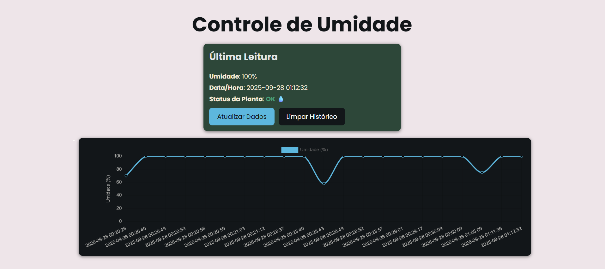

# 🌱 Monitoramento de Umidade de Planta - FrontEnd

Um aplicativo React para monitorar a umidade do solo de uma planta, utilizando um sensor conectado a um ESP32.  
O sistema coleta leituras a cada 15 minutos, ou quando o usuário solicitar, e exibe as informações em um gráfico interativo e em um card, permitindo visualizar:

- A última leitura de umidade (%).
- Um histórico de leituras com opção de limpar todos os registros.
- Um aviso se é necessário regar ou não a planta, de acordo com a umidade detectada.



## Funcionalidades

- Coleta leituras do sensor de umidade do ESP32 via HTTP.
- Conversão automática dos valores analógicos do sensor (0–4095) para porcentagem (0–100%).
- Gráfico estilizado com `react-chartjs-2` mostrando a variação da umidade no solo.
- Card com leitura atual e status “Regar” ou “Ok”.
- Botão para limpar o histórico de leituras.
- Estilização responsiva com as cores do tema e fonte Poppins.

## 🛠️ Tecnologias Utilizadas

- React
- Vite
- Chart.js
- react-chartjs-2
- ESP32 + PlatformIO
- Sensor de umidade de solo
- Coolors (para estilização)

## Como Instalar e Rodar Localmente

1. Clonar o Repositório  
```bash
git clone https://github.com/seu-usuario/controle-umidade.git
cd controle-umidade
```

2. Instalar as dependências
```bash
npm install
npm install react-chartjs-2 chart.js

```
3. Rodar o projeto
```bash
npm run dev
```

O app estará disponível em http://localhost:5173 (ou a porta indicada pelo Vite).

4. Configurar o ESP32
Tenha o código rodando no ESP32 para que as leituras sejam enviadas (link para projeto)

## Uso

- Abra a aplicação no navegador.
- Veja a umidade atual e o gráfico histórico.
- Clique no botão Limpar Histórico para apagar todos os registros.
- Confira se é necessário regar a planta:
- < 100%: aparece o alerta “Regar” (em laranja)
- ≥ 100%: aparece o status “Ok” (em verde)